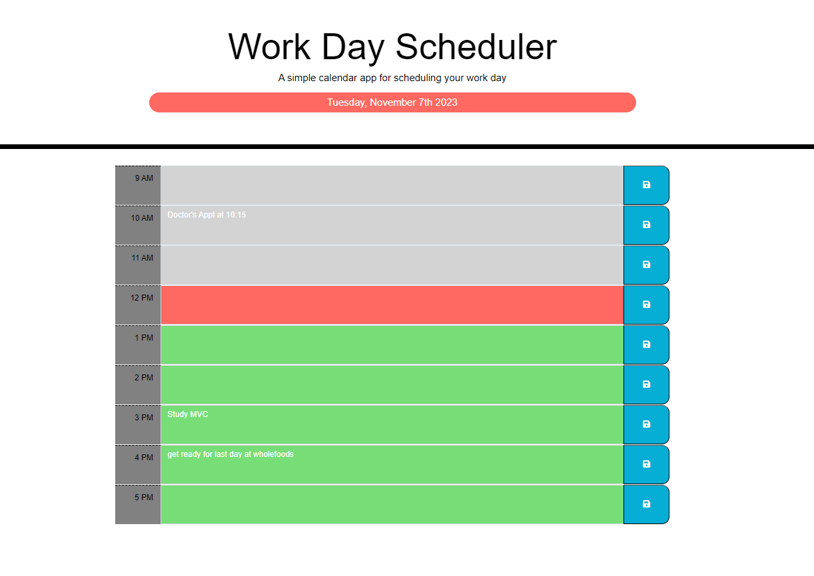

# Challenge5
Challenge5 Workday Scheduler

This challenge allows a user to save events for each hour of a typical working day.  (9am-5pm).  This app will run on a browser and  feature dynamically updated HTML and CSS powered by JQuery.  

This app was built to help me organize my daily appts, assignments, organize and clean my house, set goals, and remind me of daily task that can be easily missed during a hectic life.  

This app will keep me on track and help me stay oraganized and follow through for an ambitious personality. 

I learned that there are multiple ways of doing this and I did not need alot of code as I intially thought.  

I had challenges with defining all variables, but think think my biggest challenge is understanging how Jquery works.  Alot of time spent and it still confuses me.  I will need to take extra classes and more practice on this one.  Although it does relieve some of the coding that you do not need to add which is a positive.  

What makes this project stand out is that it has the date and keeps up with the time of date and it knows the current time, what time has passed and it knows the future time up to 5:00pm.  It saves your daily task.

My git hub link is: 
